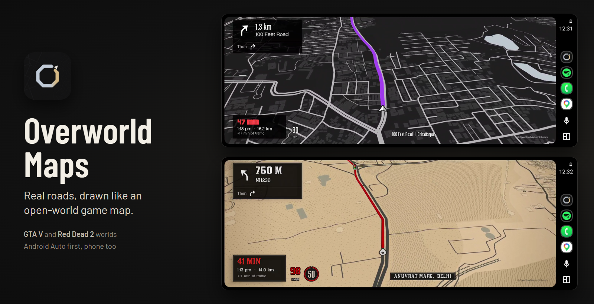
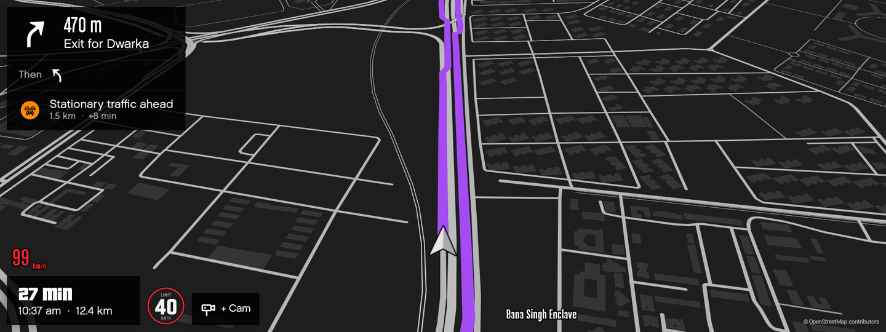
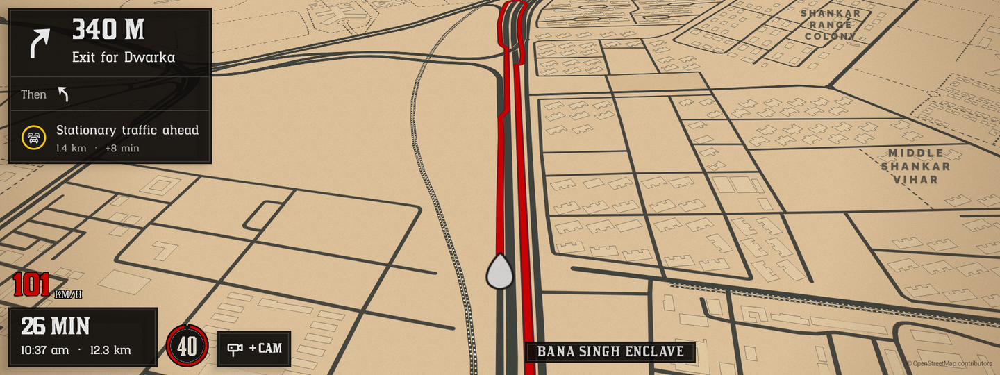
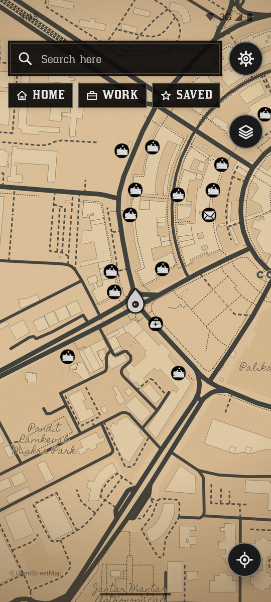
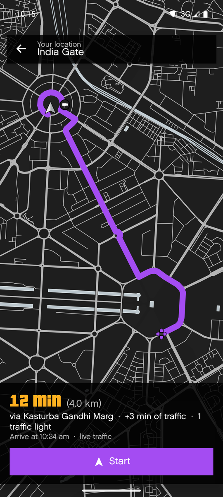
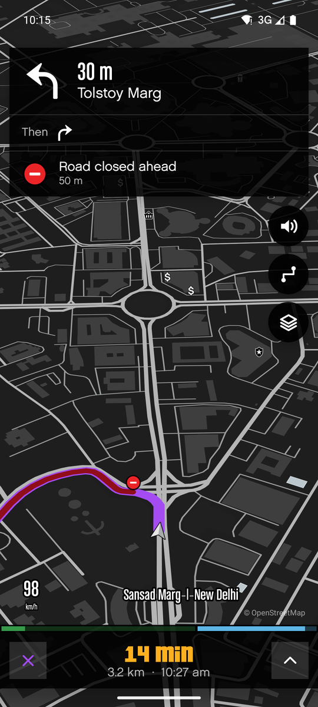
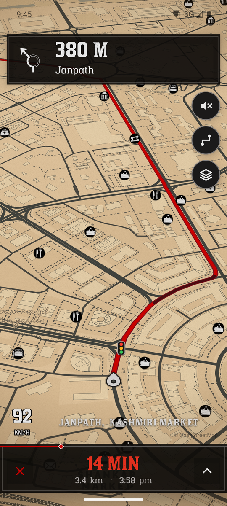
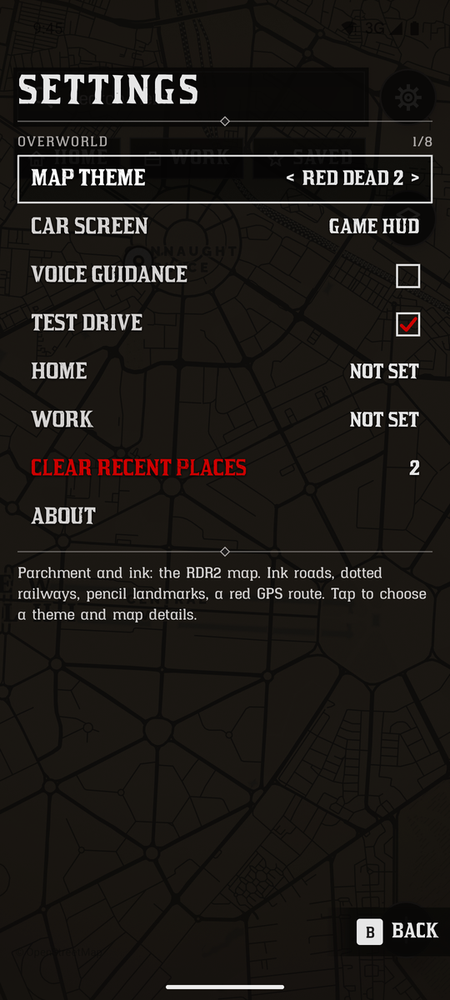
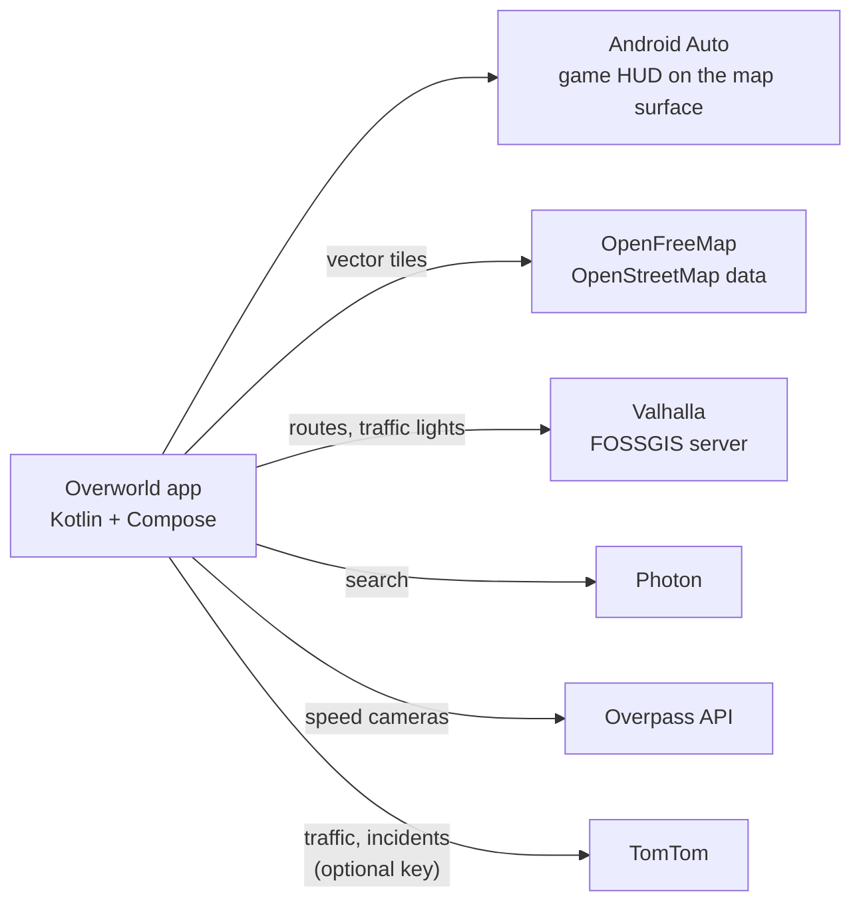

<p align="center">
  
</p>

<p align="center">
  <strong>Turn-by-turn navigation on real roads, drawn like the map in GTA V or Red Dead Redemption 2.</strong><br>
  Built for Android Auto on a car's wide screen, with the same worlds on the phone.
</p>

<p align="center">
  <a href="#screenshots">Screenshots</a>
  &nbsp;·&nbsp;
  <a href="#features">Features</a>
  &nbsp;·&nbsp;
  <a href="#how-it-works">How it works</a>
  &nbsp;·&nbsp;
  <a href="#build-it">Build it</a>
  &nbsp;·&nbsp;
  <a href="#put-it-in-the-car">Put it in the car</a>
</p>

<p align="center">
  
  
  
  
</p>

## Why Overworld Maps

Games have spent twenty years making maps people want to look at. Car navigation still draws grey lines on beige. Overworld Maps draws the real roads under your car in the style of a game's map and HUD: GTA V's near-black pause map with its purple waypoint route, or Red Dead's parchment and ink with a red trail.

It is a personal project, built first for one car: a Tata Curvv with a 10.25-inch 1920x720 HARMAN screen and wireless Android Auto. The phone app covers everything else, down to a ride on the bike.

| World | Look | Status |
|---|---|---|
| **GTA V** | The pause map: near-black land, flat grey roads, ice-pale water, no labels, the game's shop blips, a flat waypoint-purple route, a scale bar and area name in the corner. GTA menus and HUD. | Ready |
| **Red Dead 2** | Parchment and ink: ink roads, dotted railways, pencil place names, hatched forest, paper grain, a red route. Red Dead menus and HUD. | Ready |
| **GTA VI** | Night-navy land, sand boulevards, a coral route. | Waiting for the game's real map UI |
| **Next** | Minecraft, Genshin Impact, Fortnite OG, Zelda: Breath of the Wild, Cyberpunk 2077. | Planned |

## Screenshots

**In the car** (Android Auto, 1920x720):

<table>
  <tr>
    <td align="center"><br><sub>GTA V: over the limit, the sign turns red</sub></td>
    <td align="center"><br><sub>Red Dead 2: the same drive in ink</sub></td>
  </tr>
</table>

**On the phone:**

<table>
  <tr>
    <td align="center"><br><sub>The map, with blips</sub></td>
    <td align="center"><br><sub>Route preview, live traffic</sub></td>
    <td align="center"><br><sub>Driving: GTA V</sub></td>
    <td align="center"><br><sub>Driving: Red Dead 2</sub></td>
    <td align="center"><br><sub>Settings is the pause menu</sub></td>
  </tr>
</table>

## Features

- **The car screen comes first.** Our HUD owns the left of the Android Auto screen and Android Auto keeps the right: the turn card with "Then" and road alerts top-left, the time card with the speedometer and speed-limit sign bottom-left, the street name along the bottom. The route preview is a themed card with Start and Cancel drawn in the game's style.
- **Free drive.** With no trip the car map still follows you heading-up and glides between GPS fixes, with your speed and camera alerts, like Google Maps' free drive.
- **Find places on the car screen.** Search (Android Auto's keyboard while parked) and **Nearby**: petrol and CNG, food, parking, toilets, hospitals and hotels, closest first.
- **Places Google knows.** Search finds Indian places first (TomTom's business listings and OpenStreetMap), reads plus codes like `F5QR+3F New Delhi` from any Google Maps page, and takes a place shared from Google Maps (Share > Overworld) for the ones only Google has.
- **The route behaves like the games'.** The road already driven disappears behind the marker, as on GTA V's radar and Red Dead's minimap.
- **Traffic only where it matters.** Like Google's route line: amber where slow, red for jams, darkest where closed, and only on your route. Traffic on every road is one switch away in Layers, off by default.
- **Road alerts.** Traffic lights on the route, speed cameras ahead (every kind OpenStreetMap has, plus the ones you mark with **+ Cam** while driving, and an optional beep), and accidents, road works and closures that run along the route (not side streets it crosses), with how much time the traffic adds.
- **Speed-limit signs for each world**, turning red at 5 km/h over.
- **Google Maps layout, game look.** Search, Home, Work and Saved, a place sheet, a route preview, a Layers sheet with theme cards. Settings is the game's pause menu.
- **Navigation requests in the car.** When Android Auto hands Overworld a destination ("navigate to India Gate", or an address from a message), it drives there, by place name or by coordinates, even with a trip already running.
- **Made for Indian roads.** Metric, a 12-hour clock, and turn arrows for left-hand traffic: roundabouts circle clockwise and U-turns curl right.
- **Costs nothing to run.** OpenFreeMap tiles, public routing and search, and an optional free TomTom key for traffic.

## How it works



- **One theme source.** `prototype/themes.js` holds every palette and layer rule. `node tools/export-android.mjs` writes the app's MapLibre style JSON and `ThemeTokens.kt` from it, so the web prototype and the app can't drift apart.
- **Map:** MapLibre Native through MapLibre Compose, using the OpenGL build (the Vulkan build failed to compile its shaders on a Galaxy S24 Ultra, and only the background drew).
- **Navigation:** [Ferrostar](https://github.com/stadiamaps/ferrostar) 0.57 follows the route and reroutes. Valhalla plans it; India drives on the left and gets metric prompts.
- **Car:** a navigation `CarAppService`. The game HUD is drawn with Compose on the map surface in place of Android Auto's own cards, and taps on the drawn buttons are passed through to the app.
- **Traffic on our own line:** TomTom rebuilds our Valhalla route from supporting points and returns its traffic sections, so the colours sit exactly on the line we draw.

### Road info

| What | Where it comes from | Needs |
|---|---|---|
| Traffic lights on the route | Valhalla `trace_attributes` on the same server that routes (OpenStreetMap `highway=traffic_signals`), about a second per route | nothing |
| Speed cameras ahead | OpenStreetMap through Overpass, in small boxes along the route (Overpass is often busy; cameras simply arrive later) | nothing |
| Traffic on your route (amber slow, red jams, darkest where closed) | TomTom routing rebuilt along our own route (`supportingPoints`, `sectionType=traffic`) | TomTom key |
| Traffic on every road (off unless turned on in Layers): highways from city zoom, arterials from 13, streets from 14.5, only roads slower than usual | TomTom traffic-flow vector tiles, coloured per theme | TomTom key |
| Accidents, road works, closures, lane closures, flooding along the route, and stationary traffic ahead | TomTom incident details, refreshed every 2.5 minutes while driving | TomTom key |
| Time to go with traffic, and "+21 min of traffic" (travel time minus empty-road time) | the same TomTom request as the route traffic | TomTom key |

**TomTom key (free, no card):** sign up at developer.tomtom.com, copy the default API key, add `tomtomKey=<key>` to `android/local.properties` (gitignored), rebuild. The free tier gives 2,500 non-tile and 50,000 tile requests a day, far more than one driver uses. Without a key the app works as before and Layers shows those rows as off.

## Game fonts and art

The games' own fonts (Pricedown, Chalet, RDR Lino, RDR Catalogue, Hapna Slab Serif) and Rockstar's map blips are commercial or Rockstar Games property, so they are **not in this repository**. The app loads them from `android/app/src/local/` when that folder exists (it's gitignored) and otherwise uses free stand-ins with similar shapes: Barlow, Barlow Condensed, Passion One, Chakra Petch and IM FELL English, with redrawn vector icons. A clone builds and runs; it just looks a little less like the games. The screenshots above come from the author's build, which has them.

The speed-limit signs and the app icon are the author's own artwork.

## Build it

You need JDK 21 and the Android SDK.

```powershell
powershell -File tools/build-install.ps1          # build the debug APK and install it on the connected phone or emulator
```

Or by hand from PowerShell: `cd android; .\gradlew.bat :app:assembleDebug`. Debug builds are their own app, `com.thealgothrim.overworld.debug` ("Overworld debug"), so they install next to the Play copy instead of over it. Don't call `gradlew.bat` from Git Bash when the path has a space in it: it fails without an obvious error and the old APK stays in place.

After changing a theme in `prototype/themes.js`, run `node tools/export-android.mjs`, then rebuild.


### On the phone

1. Settings > About phone > Software information > tap **Build number** 7 times, then turn on Developer options > **USB debugging**.
2. Plug into the computer and accept the prompt.
3. `adb install -r android/app/build/outputs/apk/debug/app-debug.apk`

The phone app works fully like this. Turn on **Test drive** in Settings to simulate a trip without driving.

### Android Auto on a laptop (no car needed)

1. Phone: Settings > Connected devices > **Android Auto** > tap **Version** 10 times to unlock developer mode.
2. Android Auto's ⋮ menu > **Developer settings** > turn on **Unknown sources**.
3. Back on the **main** Android Auto page, ⋮ menu > **Start head unit server**.
4. Phone on USB. Run the Desktop Head Unit from a console window (it quits if its console has no input):
   ```bat
   adb forward tcp:5277 tcp:5277
   cd /d "%LOCALAPPDATA%\Android\Sdk\extras\google\auto" && desktop-head-unit.exe -c config\tata_curvv.ini
   ```
   Copy `tools/dhu/tata_curvv.ini` (1920x720, right-hand drive) into the SDK's `extras\google\auto\config` first.
5. Overworld is in the Android Auto app drawer. Pick a destination on the phone.

If the head unit sits on "Waiting for phone", stop and start the head unit server, then relaunch it.

**Test drives from the laptop** (debug builds, works with the phone locked):

```bat
adb shell am broadcast -n com.thealgothrim.overworld.debug/com.thealgothrim.overworld.DebugDriveReceiver -a com.thealgothrim.overworld.DEBUG_DRIVE --es theme gta5 --ef lat 28.6129 --ef lng 77.2295 --es name "India%sGate"
adb shell am broadcast -n com.thealgothrim.overworld.debug/com.thealgothrim.overworld.DebugDriveReceiver -a com.thealgothrim.overworld.DEBUG_STOP
```

The drive starts where the phone is. Add `--ef from_lat 28.6315 --ef from_lng 77.2167` to start somewhere else, here on Connaught Place's Outer Circle, a good test for roundabouts. `--es query "India%sGate"` drives to a place by name, the way a request from Android Auto arrives, and `--ez test false` makes it a real trip on the phone's GPS. `-a com.thealgothrim.overworld.DEBUG_STATE` logs what the app holds (trip, simulator, route extras, voice) under the `DebugDrive` tag.

**Tests** (`android/app/src/androidTest`, need a phone or emulator with internet): real Delhi and Chandigarh routes run through Android Auto's builders step by step, navigation requests in every link form, trips stopped as they start, search and Nearby on the car screen, and the car screen itself. `.\gradlew.bat :app:testDebugUnitTest` checks plus codes, typed coordinates and Google Maps links without a device. Run them on an emulator, since `connectedDebugAndroidTest` uninstalls the app afterwards. Put the emulator in Delhi first (`adb emu geo fix 77.2167 28.6315`); by default it thinks it's in California. Then install both APKs from `assembleDebug assembleDebugAndroidTest` and run `adb shell am instrument -w com.thealgothrim.overworld.debug.test/androidx.test.runner.AndroidJUnitRunner`.

Map icons and labels don't draw on the emulator's default software GPU. Start it on the computer's GPU: `emulator -avd <name> -gpu host`.

## Put it in the car

Android Auto won't show a sideloaded navigation app in a real car ([Google's testing docs](https://developer.android.com/training/cars/testing)). It has to come from Google Play. Play's **internal testing** track skips the review and reaches up to 100 testers within minutes:

1. Create a Google Play Console developer account (USD 25 once, plus an identity check), then **Create app** with the package name `com.thealgothrim.overworld`.
2. Make an upload key (`keytool -genkeypair -keystore overworld-upload.jks -alias upload -keyalg RSA -keysize 4096 -validity 12000`) and put `uploadStoreFile`, `uploadStorePassword`, `uploadKeyAlias` and `uploadKeyPassword` in `android/local.properties`. Keep the key out of the repo. Play re-signs the app with its own key, and a lost upload key can be reset in Play Console.
3. Build the release bundle: `.\gradlew.bat :app:bundleRelease` (`android/app/build/outputs/bundle/release/app-release.aab`). Play's tracks refuse debug builds, and a bundle rather than an APK because the APK carries the map engine for four kinds of phone chip; from the bundle, Play sends each phone only its own.
4. Play Console > Test and release > Testing > **Internal testing**: under Testers, make an email list with your Google account. Under Releases, **Create new release**, let Google manage the app signing key, upload the bundle and roll it out.
5. Open the testers' opt-in link on the phone, accept, and install from Play. Overworld then appears in the car's Android Auto launcher. Later versions arrive as ordinary Play Store updates.

Internal app sharing (a link per upload, debug builds allowed) only works once the app has been published on a track, so it can't be the first step.

## Project structure

```text
android/              the app (Kotlin, Jetpack Compose, Android Auto)
  app/src/main/       code, map styles, sprites, glyphs, speed-limit signs
  app/src/local/      game fonts and blips for personal builds (gitignored, optional)
prototype/            web preview of the themes on a recorded Delhi drive; themes.js is the theme source
tools/                style export, sprite, glyph, icon and sign builders, build script, DHU preset
docs/readme/          the images on this page (tools/readme_hero.py draws the banner)
licenses/             licence texts for the bundled fonts
```

| Tool | What it does |
|---|---|
| `tools/export-android.mjs` | Writes the app's style files and `ThemeTokens.kt` from `themes.js` |
| `tools/make_sprite.py` | Builds Red Dead's hatch and stipple patterns and the map blips |
| `tools/make_glyphs.py` | Builds Red Dead's map-label fonts as MapLibre SDF glyphs |
| `tools/make_icon.py` | Builds the adaptive app icon from the artwork in `tools/icon/` |
| `tools/make_limit_signs.py` | Cuts the speed-limit sign sheets in `tools/signs/` into app drawables |
| `tools/build-install.ps1` | Builds the debug APK and installs it |
| `tools/make_route.py` | Re-records the prototype's demo route |

## Known limits

- Tested on a Galaxy S24 Ultra and on the Desktop Head Unit at the Curvv's screen size. The first run in the real car is waiting on the Play step above.
- The public routing and search servers are fair-use: fine for one driver, not for a public app with many users.
- OpenStreetMap knows few of Delhi's speed cameras (about 9 speed cameras and 40 enforcement cameras in the NCR core). Radarbot's list is its own and can't be used, so cameras you mark fill the gaps on your roads.
- Small places only Google lists (a house, a small church) aren't in OpenStreetMap or TomTom. Share them from Google Maps, or type their plus code.
- GTA V hides map labels, like the game's pause map. Red Dead's label glyphs cover Latin scripts only.
- No offline maps yet (OpenFreeMap has no India extract download; Protomaps PMTiles would be the way).
- Android refuses the background location service if a trip starts while the app isn't on screen. The app then keeps navigating while the phone or car screen shows it, instead of crashing.
- Contour lines like Red Dead's paper map aren't possible from OpenFreeMap, which has no contour layer.

## Credits

Map data © OpenStreetMap contributors (ODbL). Tiles: OpenFreeMap, OpenMapTiles schema. Routing and traffic lights: Valhalla on the FOSSGIS server. Speed cameras: Overpass API. Live traffic (optional): TomTom. Search: Photon by komoot. Navigation: Ferrostar by Stadia Maps (BSD 3-Clause). Turn arrows: Mapbox Directions Icons (CC0). Fonts: Barlow, Barlow Condensed, Chakra Petch, IM FELL English, Passion One, Crimson Text, Merriweather, Raleway (SIL Open Font License) and Homemade Apple (Apache 2.0). Details in `THIRD_PARTY_NOTICES.txt` and `licenses/`.

Overworld Maps is a fan project. It is not affiliated with or endorsed by Rockstar Games or Take-Two Interactive. Grand Theft Auto and Red Dead Redemption are their trademarks, named here only to say which game each look is modelled on.

## Licence

Copyright © 2026 Gaurav Kumar, [The Algothrim](https://thealgothrim.com). All rights reserved.

The code is public to read and learn from. It is not licensed for reuse. Third-party code, fonts and data keep their own licences.
